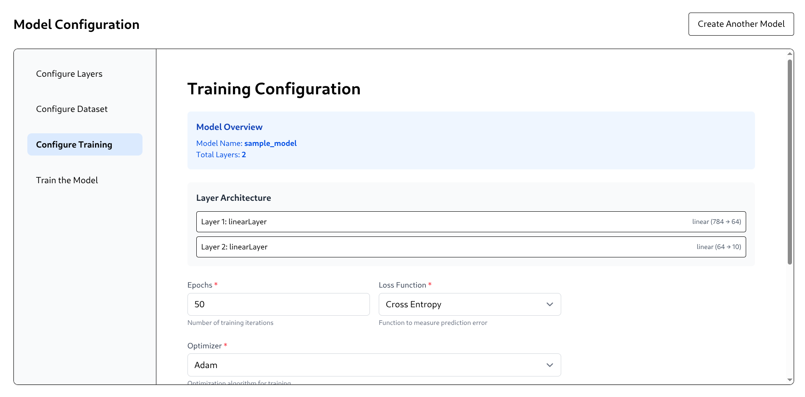
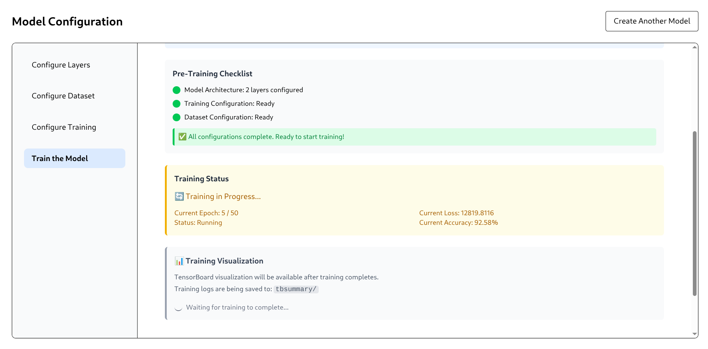

# Synapse Works

## Overview
Architect, Train & Evaluate your Neural Networks in seconds

### Features
- Intuitive UI for creating neural networks, training them and visualizing them
- Supports multiple backends (although currently only pytorch)(future implementations might have keras, tf and jax)
- Utilizes industry standard Tensorboard for visualizing the validation curves

### Screenshots



## Getting started
### Pre-requsities (Linux/Mac)(Unfortunately WSL is required for running in Windows)
- [miniconda](https://www.anaconda.com/docs/getting-started/miniconda/install#linux-terminal-installer)
- [redis-server](https://redis.io/docs/latest/operate/oss_and_stack/install/install-stack/)

### Installation
Install's conda environment & required modules
```bash
sh install.sh
```
Start the session
```bash
sh start.sh
```
End the session
```bash
sh end.sh
```

## Installation
### Pre-requsities
- [miniconda](https://www.anaconda.com/docs/getting-started/miniconda/install#linux-terminal-installer)
- [redis-server](https://redis.io/docs/latest/operate/oss_and_stack/install/install-stack/)
### Clone the repo
```bash
git clone https://github.com/SuriyaaMM/synapse-works
cd synapse_works
```
### Create `conda` environment (Recommended)
```bash
conda create env -f environment.yaml
```
### Initialize npm modules
```bash
npm install && cd frontend && npm install && cd ../
```

## Instructions for Running
Have two terminals open, in first one
```bash
npm start
```
in second one
```bash
python service/worker.py
```
